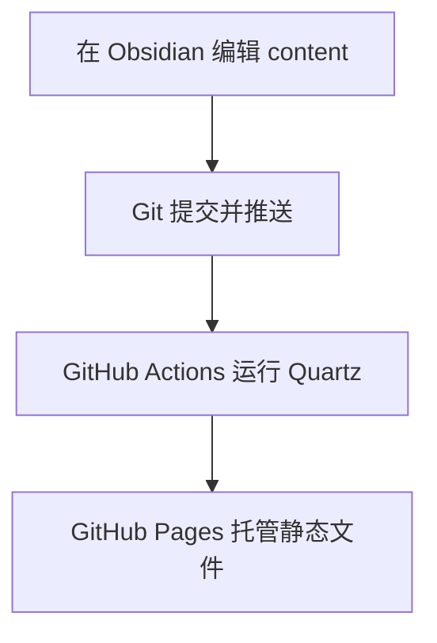

这个原型将“写作”和“托管”拆成四层：



## 第一次部署

1. 在 GitHub 创建一个公开空仓库。
2. 将本目录提交并推送到仓库的 `main` 分支。
3. 在仓库的 **Settings → Pages → Source** 中选择 **GitHub Actions**。
4. 等待 `Deploy Quartz to GitHub Pages` 工作流完成。

工作流会根据仓库名自动计算 Pages 地址，不需要预先知道 GitHub 用户名。

## 日常发布

1. 在 Obsidian 中编辑 `content/`。
2. 给准备公开的笔记添加 `publish: true`。
3. 本地预览并执行隐私检查。
4. 提交并推送；GitHub 会自动重新部署。

## 本地预览

```powershell
pnpm install
$env:QUARTZ_PROTOTYPE = "1"
node .\quartz\bootstrap-cli.mjs build --serve
```

本机浏览器访问 `http://localhost:8080`。视觉原型可以通过 `?variant=A`、`?variant=B` 和 `?variant=C` 直接定位。

> [!note]
> 如果系统已经安装 Node.js 和 npm，也可以使用 Quartz 官方文档中的 `npm ci` 与 `npx quartz build --serve`。
